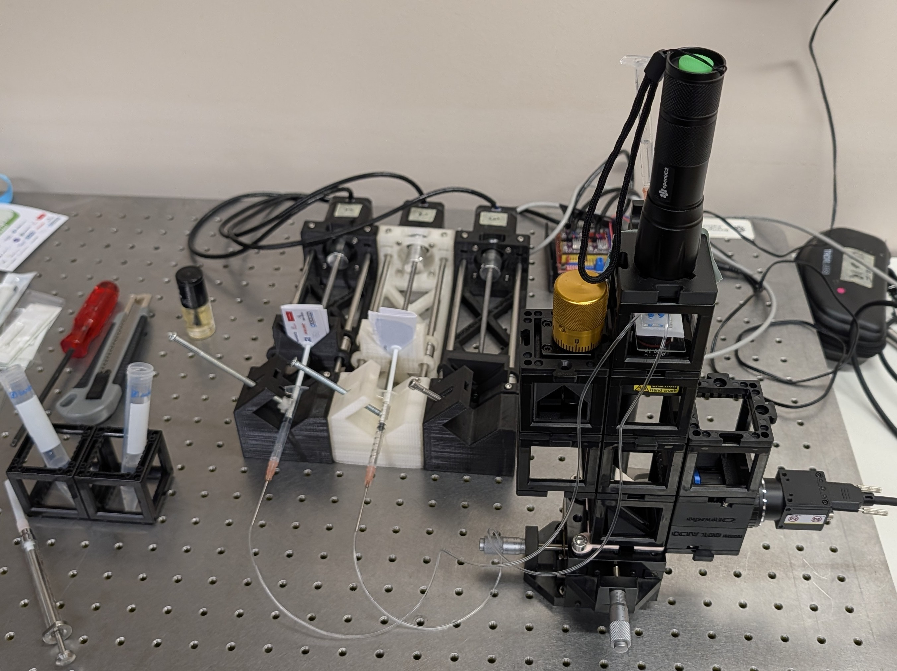
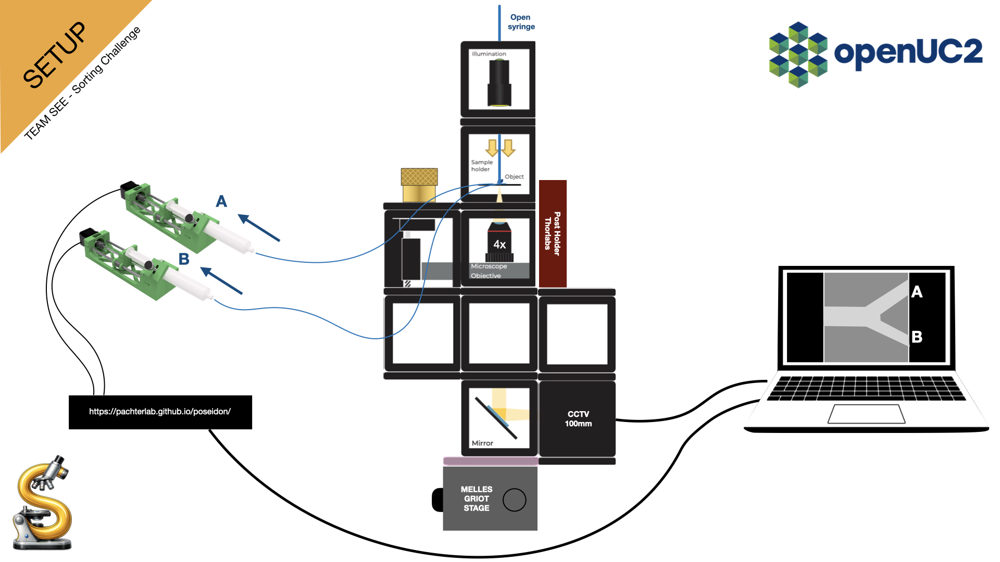
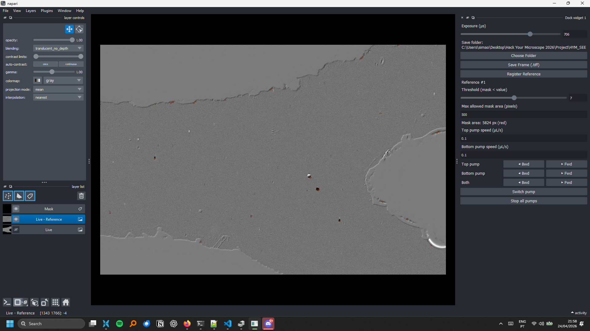

# Hack your microscope 2026 challenge - Group See

This repository contains all of the resources developed by group See for the HYM 2 day challenge: Organoid sorting with microfluidics.

The code provides visualization of the image caputred by a Hikrobotics camera with simultaneous control of the poseidon syringe pump system. On top of the real-time image we compute a difference image with respect to a reference and then identify flowing particles based on a tunable threshold level. Once the mask is computed the size of the particles is estimated by counting the total masked pixels.

## List of materials

-  [Poseidon pump system](https://github.com/pachterlab/poseidon)
-  [OpenUC2 Corebox](https://openuc2.com/product-overview-2/)
-  [Hikrobotics MV-CS060-10UM-PRO](https://www.hikrobotics.com/en/machinevision/productdetail/?id=5715)
-  [3x 1ml BD plastic syringe](https://www.digikey.pt/short/93zf92hf)
-  [2m of Tygon tube ND-100-80 (ID: 0.04 in, OD: 0.07 in)](https://darwin-microfluidics.com/products/tygon-nd-100-80-micro-tubing)
-  [3 Tube Tuck Luer Connector for 1/16 tubing (1 pack)](https://www.microfluidic-chipshop.com/connectors/1243-2683-tube-tuck-mini-luer-connector-for-116-tubing-fluidic-158-html#/20-material-tpe/26-color-blue)
-  [Custom open UC2 adapter plate for the XY stage](https://github.com/fevemo/HYM_SEE/blob/main/adapter_base_puzzle_v3.stl)
-  XY stage with M6 holes.
-  3x M6 screws
-  Slide holder made with Thorlabs parts: post-holder, optical post and two CL5 parts to clamp the microfluidic chip, using an M6 screw.
-  Windows PC.



## Optical setup
The microscope was build using the [OpenUC2 Corebox](https://openuc2.com/product-overview-2/). Documentation about the corebox can be found [here](https://docs.openuc2.com/usage/disc/corebox/en/core_intro/). The optical setup was adapted to be able to fit on a Melles Griot Stage for XY translation while fixing the sample with a Thorlabs post holder. An [adaptor](https://github.com/fevemo/HYM_SEE/blob/main/adapter_base_puzzle_v3.stl) was designed to fix the openUC2 microscope to the stage. 



## Microfluidics design
The microfluidics [channel design](https://github.com/fevemo/HYM_SEE/blob/main/microfluidic-channel.stl) was lasercut into two layers of double sided tape, after which it was sticked on a glass microscopy slide. On top, a PMMA layer with in and outlets of 2.5mm (lasercut) was sticked on the top of the chip. ChipShop adaptors were inserted into the in and outlets to attach the tubing to the chip and connect them with the two syringe pumps. The inlet of the chip was connected with an open syringe in which the diluted particle sample can be loaded.

## Pump control
The Poseidon pumps were used in their original configuration and controled via serial commands from a custom python API. The API converts real-time control commands such as forward, back, stop, etc. into the command strings the Poseion arduino system expects. This was a great way to get up and running quickly but the serial comunication starts having issues as soon as several commands are sent in quick successsion. In the future it would be better to modify the pump controller to accomodate better real-time control.

## Graphical User Interface
The GUI was made using napari as the main block. The camera and the syringe pumps were connected to the PC, and the communication was managed using Python. New frames were acquired in real time and used to update a napari layer, which enabled real-time visualization of the microfluidic chip. Some basic functions were implemented for camera control, such as the ability to change the exposure time of the camera and choose a folder in the PC for .tiff snap capture saving.

The ability to programmatically control the two syringe pumps was also implemented on the GUI, with speed control for each one and the ability to choose the pulling or pushing motion of the syringe, creating a forward or backward fluidic motion. Finally, a referencing button was also added, which could be used to create a subtraction image (subtraction_image = live - reference), which could be used for the segmentation of beads in the FOV.



## Setup

**macOS/Linux:**
```sh
./install.sh
source .venv/bin/activate
```

**Windows:**
```bat
install.bat
.venv\Scripts\activate
```

The install scripts will set up a Python 3.11 virtual environment and install all dependencies automatically.

## Run

Make sure the virtual environment is activated (see Setup above) before running. You need to do this each time you open a new terminal. Then run the desired code. 

```sh
python src/main_GUI.py
```

## Limitations / To-Dos:
1.	Software:
   
-	build on the already existing particle recognition and implement an automated feedback loop to the pumps to steer the particles to the correct outlet channel automatically.
  
2.	Hardware components:
 	
a.	Microfluidics:
-	Fine tuning of the pumps with adaptation of the pump’s response time for a more accurate sorting mechanism
-	Fine tuning of the microfluidic chamber width to optimise the response time to the pump system
-	The microfluid chip can be improved with a more optimised manufacturing process to achieve smoother edges.
-	a better inlet mechanism could be implemented to sort larger amounts of the sample.
  
b.	Optical Setup:
-	Implement a Fluorescence module for sorting based on spectral readout.


